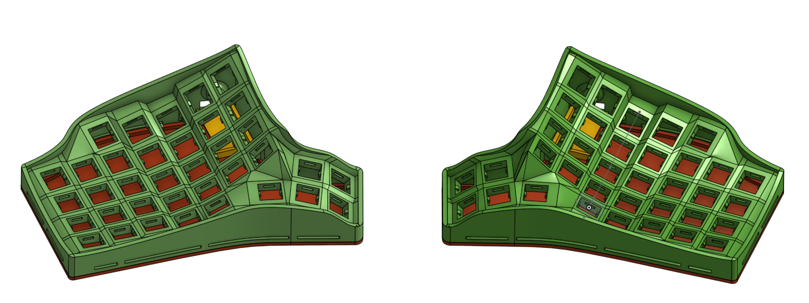
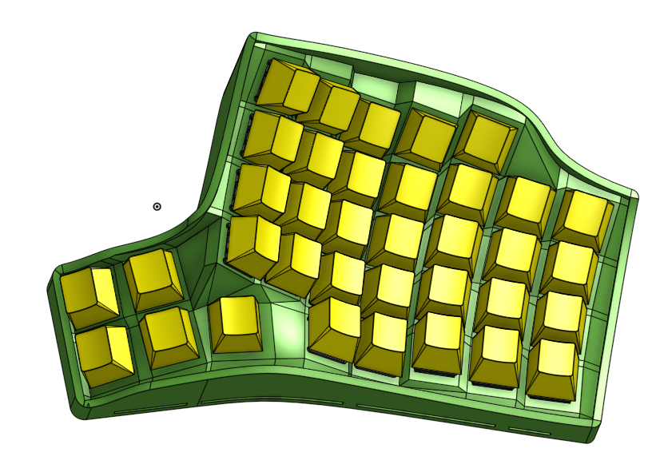

# ocopus




A keyboard that is inspired by the [Ergodox](https://www.ergodox.io/) and [Redox]((https://github.com/mattdibi/redox-keyboard) layouts and whose shape was inspired by the [Dactyl](https://github.com/adereth/dactyl-keyboard) keyboard.

Keyboard Maintainer: [Sundara Tejaswi Digumarti](https://github.com/tejaswid)  
Hardware Supported: Hand wired, works with Arduino Pro Micro.  
Hardware Availability: write to me if you are interested. I only developed it as a hobby project.  

To build the firmware for this keyboard (after setting up your build environment):

```sh
    make ocopus:default
```

To build and flash the firmware:

```sh
	make ocopus:default:avrdude
```

See the [build environment setup](https://docs.qmk.fm/#/getting_started_build_tools) and the [make instructions](https://docs.qmk.fm/#/getting_started_make_guide) for more information. Brand new to QMK? Start with our [Complete Newbs Guide](https://docs.qmk.fm/#/newbs).
